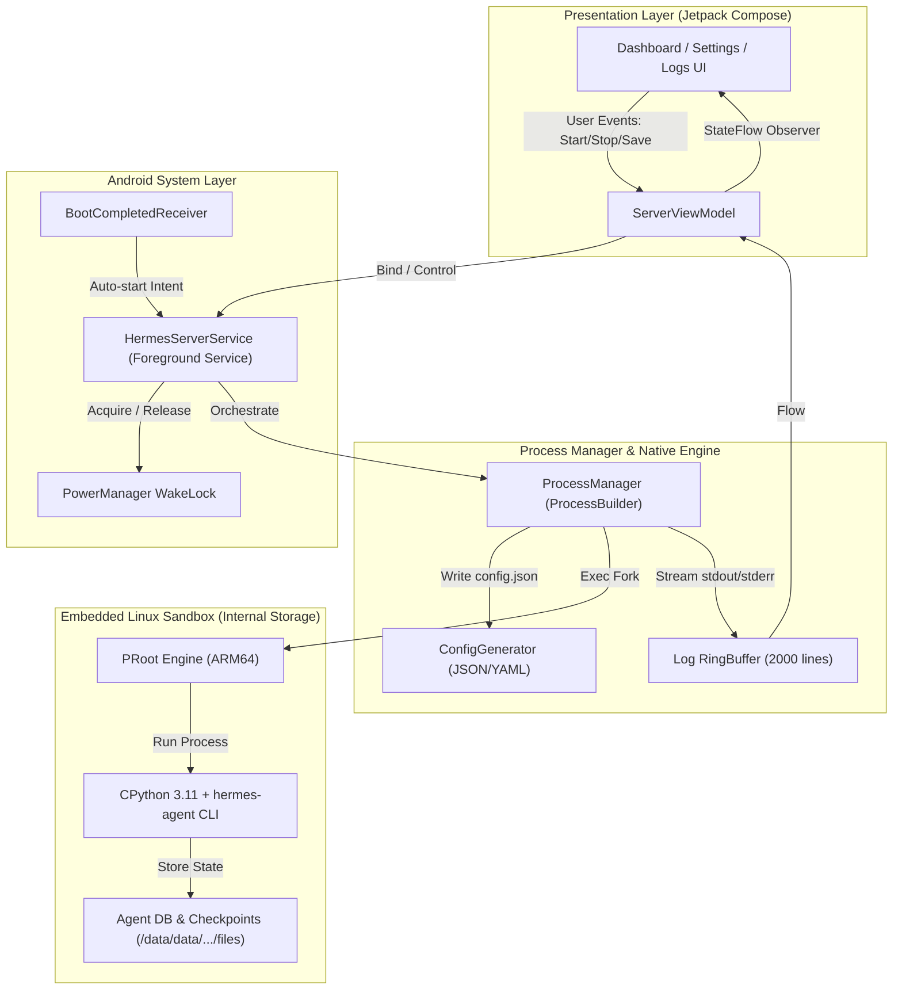

# Architecture Spine — Hermes Android Server (Hermes Node)

## 1. Design Paradigm

The system adopts a **Sidecar Process Daemon + Unidirectional Data Flow (UDF)** paradigm:
- **Presentation Layer (UI)**: Pure Kotlin Jetpack Compose driven by immutable `ServerUiState` emitted from ViewModels via Kotlin `StateFlow`.
- **System Controller Layer**: Android `ForegroundService` acting as the master lifecycle orchestrator, owning the partial `WakeLock`, system notification, and process controller.
- **Process Manager (Engine)**: Manages the lifecycle of the isolated POSIX child process (`PRoot` + Python 3.11 CPython binary + Hermes Agent) running inside the app's internal sandbox.
- **Data & Configuration Layer**: Android `EncryptedSharedPreferences` for secure secret storage, generating atomic configuration JSONs consumed by the Python sidecar.



---

## 2. Invariants & Rules

### AD-1 — Native Kotlin & Jetpack Compose [ADOPTED]
- **Binds:** UI Layer, ViewModels, System Service Integration
- **Prevents:** Cross-platform bridge overhead (Flutter/React Native) that complicates low-level Android Foreground Service, Direct Boot, and JNI POSIX process manipulation.
- **Rule:** The entire frontend and Android service layer MUST be implemented in Kotlin using Jetpack Compose and Material 3 design components.

### AD-2 — Embedded PRoot Linux Userland [ADOPTED]
- **Binds:** FR-1, FR-2, FR-12
- **Prevents:** Agent skill failures when executing standard Linux utilities (bash, python, ripgrep, git) that standard Android sandboxes restrict.
- **Rule:** The Python environment and native utilities MUST execute within an embedded ARM64 PRoot / Termux-compatible userland stored in internal app data (`/data/data/com.hermes.node/files/usr`). The app MUST NOT require an external Termux APK.

### AD-3 — Always-On Daemon & WakeLock Lifecycle [ADOPTED]
- **Binds:** FR-6, FR-7, FR-8, FR-9
- **Prevents:** Android Doze mode and OS low-memory killers from terminating or freezing the server process when the screen turns off.
- **Rule:** The Hermes daemon MUST only run under an active `ForegroundService` holding a `PowerManager.PARTIAL_WAKE_LOCK`. Server termination MUST gracefully send `SIGTERM` with a 5-second fallback to `SIGKILL`. Auto-start MUST be handled via `RECEIVE_BOOT_COMPLETED`.

### AD-4 — Non-Blocking Coroutine Log Streaming [ADOPTED]
- **Binds:** FR-10, FR-11
- **Prevents:** UI thread blocking and memory leaks caused by unbounded terminal stdout/stderr stream growth.
- **Rule:** Process `stdout` and `stderr` streams MUST be read asynchronously on `Dispatchers.IO` using a thread-safe circular `RingBuffer` capped at 2,000 lines. The UI MUST consume log updates via throttled `StateFlow`.

### AD-5 — Secure Config Generation & At-Rest Encryption [ADOPTED]
- **Binds:** FR-3, FR-4, FR-5
- **Prevents:** Plain-text exposure of LLM API keys and bot tokens on the filesystem or device backups.
- **Rule:** Credentials MUST be encrypted using Android Keystore / `EncryptedSharedPreferences`. The generated `hermes.json` configuration file written to disk MUST have POSIX file permissions set to `0600` (read/write by app UID only).

### AD-6 — Optional Cloudflare Tunnel Sidecar [ADOPTED]
- **Binds:** FR-14
- **Prevents:** Complex router port-forwarding and dynamic DNS configuration for users exposing the Hermes local web dashboard or webhooks.
- **Rule:** Remote tunneling MUST be managed as a secondary independent sidecar process (`cloudflared` ARM64 binary) that parses the generated public URL and pushes it to `ServerUiState`.

---

## 3. Consistency Conventions

| Concern | Convention |
| :--- | :--- |
| **Package Structure** | `com.hermes.node` with subpackages: `.ui`, `.service`, `.engine`, `.data`, `.domain`, `.util` |
| **State Management** | Unidirectional Data Flow: `UiState` (data class) + `UiEvent` (sealed class) + `ViewModel` |
| **Service Communication** | Bound Service with `IBinder` / Kotlin `SharedFlow` for IPC between Activity and Background Service |
| **File Paths** | Sandbox root: `/data/data/com.hermes.node/files`<br>Rootfs: `.../files/usr`<br>Config: `.../files/hermes.json`<br>Data: `.../files/agent_data` |
| **Error Handling** | Result wrapper `Result<T>` for all domain and engine operations; never crash UI on subprocess error |

---

## 4. Stack

| Technology / Component | Version / Specification |
| :--- | :--- |
| **Language** | Kotlin 2.0+ / Java 17 |
| **UI Framework** | Android Jetpack Compose (BOM 2024.09+) |
| **Async / Reactive** | Kotlin Coroutines 1.8+ & StateFlow / SharedFlow |
| **Min Android SDK** | API 28 (Android 9.0 Pie) |
| **Target / Compile SDK** | API 35 (Android 15) |
| **Linux Engine** | PRoot ARM64 (v5.3+) + Termux base bootstrap |
| **Python Runtime** | CPython 3.11.x (ARM64 pre-compiled) |
| **Agent Core** | `hermes-agent` (Nous Research, latest release) |
| **Tunneling Sidecar** | Cloudflared ARM64 (v2024.8+) |
| **Security** | AndroidX Security Crypto (`EncryptedSharedPreferences`) |

---

## 5. Structural Seed & Directory Layout

```text
hermes-android-server/
├── app/
│   ├── src/main/
│   │   ├── AndroidManifest.xml
│   │   ├── assets/
│   │   │   ├── bootstrap-arm64.tar.xz       # Pre-compiled Python 3.11 + PRoot + dependencies
│   │   │   └── cloudflared-arm64             # Optional tunnel binary
│   │   ├── java/com/hermes/node/
│   │   │   ├── ui/                           # Jetpack Compose Screens & Theme
│   │   │   │   ├── MainActivity.kt
│   │   │   │   ├── dashboard/                # DashboardScreen, StatusCards, PowerMetrics
│   │   │   │   ├── settings/                 # SettingsScreen, ProviderForm, BotForm
│   │   │   │   ├── logs/                     # ConsoleLogScreen, LogFilterBar
│   │   │   │   └── theme/                    # Color, Typography, Theme
│   │   │   ├── service/                      # Android System Service & Receivers
│   │   │   │   ├── HermesServerService.kt    # ForegroundService + WakeLock
│   │   │   │   ├── BootReceiver.kt           # Auto-start on boot
│   │   │   │   └── NotificationHelper.kt     # Ongoing Notification Controller
│   │   │   ├── engine/                       # Native Subprocess Management
│   │   │   │   ├── ProcessManager.kt         # ProcessBuilder, PRoot wrapper, signals
│   │   │   │   ├── BootstrapExtractor.kt     # Unpack & verify runtime assets
│   │   │   │   ├── LogStreamer.kt            # Circular RingBuffer & ANSI color parser
│   │   │   │   └── TunnelManager.kt          # Cloudflared process controller
│   │   │   ├── data/                         # Persistence & Config Serialization
│   │   │   │   ├── ConfigRepository.kt       # EncryptedSharedPreferences wrapper
│   │   │   │   ├── ConfigSerializer.kt       # Writes hermes.json / .env
│   │   │   │   └── model/                    # HermesConfig, LLMProvider, GatewayConfig
│   │   │   └── domain/                       # Use Cases & Business Logic
│   │   │       ├── StartServerUseCase.kt
│   │   │       ├── StopServerUseCase.kt
│   │   │       └── GetServerMetricsUseCase.kt
│   │   └── res/                              # Drawables, Strings, Icons
│   └── build.gradle.kts
├── _bmad/                                    # BMad Framework Core
└── README.md
```

---

## 6. Capability → Architecture Map

| Capability / Requirement | Lives in | Governed by |
| :--- | :--- | :--- |
| **FR-1, FR-2 (Bootstrap & Health)** | `com.hermes.node.engine.BootstrapExtractor` | AD-2 (PRoot Userland) |
| **FR-3, FR-4, FR-5 (Config & Secrets)** | `com.hermes.node.data.ConfigRepository` | AD-5 (Encrypted Storage) |
| **FR-6, FR-7, FR-8, FR-9 (Always-On Daemon)** | `com.hermes.node.service.HermesServerService` | AD-3 (WakeLock & Service) |
| **FR-10, FR-11 (Telemetry & Console)** | `com.hermes.node.engine.LogStreamer` & `ui.logs` | AD-4 (Coroutine IO RingBuffer) |
| **FR-12, FR-13 (Skills & Memory)** | `com.hermes.node.ui.settings` & `data` | AD-1, AD-5 |
| **FR-14 (Cloudflare Tunnel)** | `com.hermes.node.engine.TunnelManager` | AD-6 (Tunnel Sidecar) |

---

## 7. Deferred Items

1. **x86_64 Emulator Support**: Deferred to v1.1. v1.0 targets physical ARM64 (`aarch64`) Android devices exclusively to optimize asset size.
2. **Local SLM Fallback Execution**: Deferred to v2.0. Focus is 100% on the cloud-orchestration gateway.
3. **P2P Multi-Device Node Sync**: Deferred to future roadmap.
